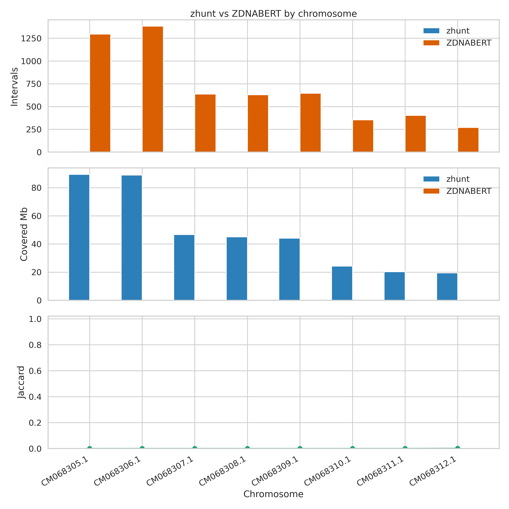
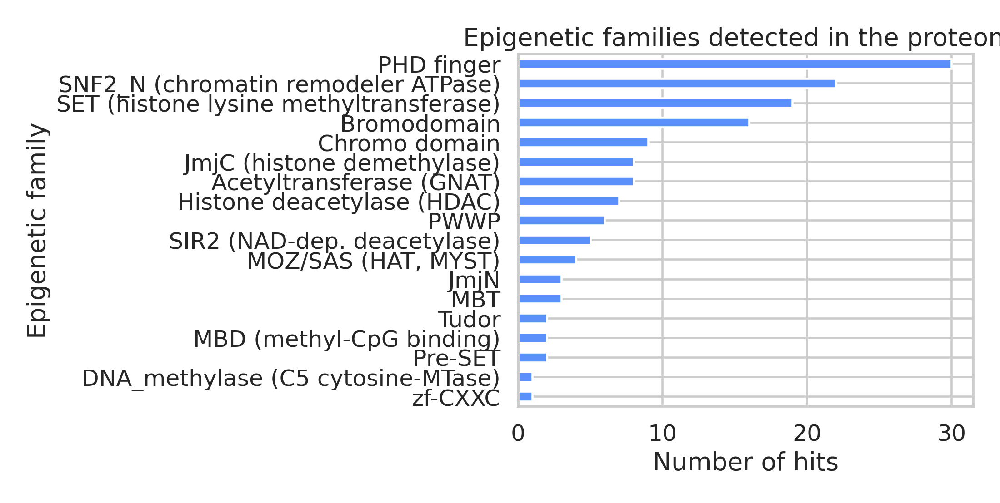
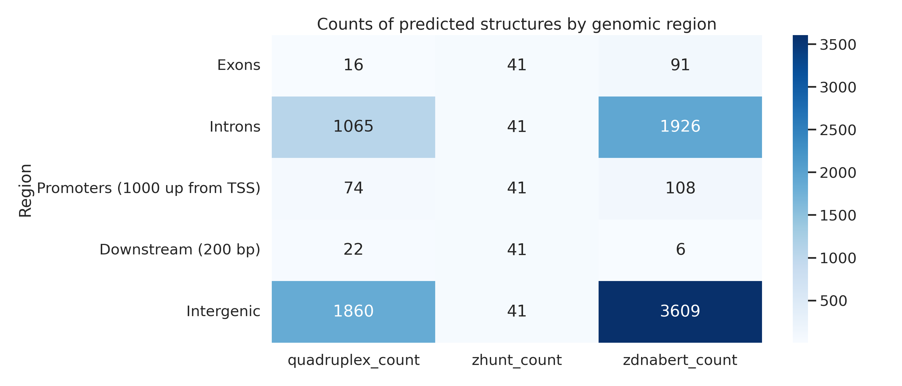
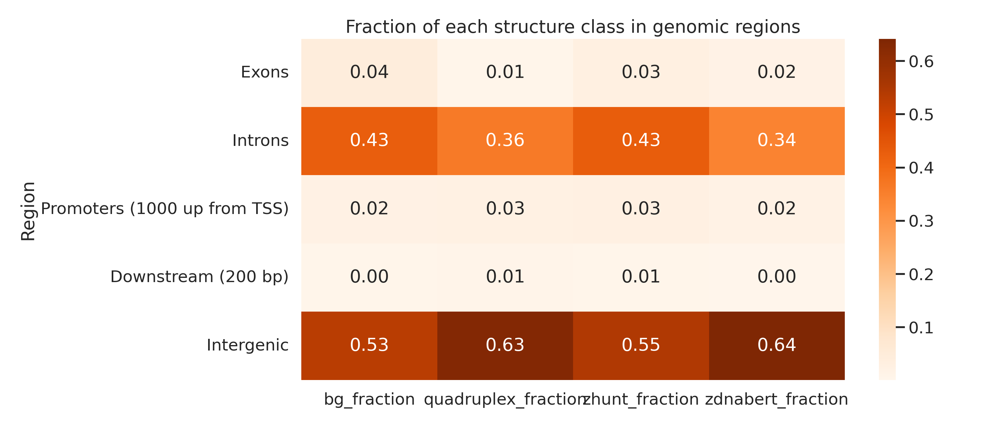

# Индивидуальное задание: Schistosoma mekongi

Итоговый проект по двухлетнему майнору биоинформатики НИУ ВШЭ.

[ссылка на вики страницу курса](http://wiki.cs.hse.ru/%D0%9C%D0%B0%D0%B9%D0%BD%D0%BE%D1%80_%D0%91%D0%B8%D0%BE%D0%B8%D0%BD%D1%84%D0%BE%D1%80%D0%BC%D0%B0%D1%82%D0%B8%D0%BA%D0%B0_2_%D0%B3%D0%BE%D0%B4_2025/26)

## 1. Краткое описание выбранного организма

*Schistosoma mekongi* — кровяной сосальщик из группы трематод, паразит человека и животных. Вид важен для эпидемиологии в Юго-Восточной Азии и представляет интерес для изучения организации генома, эпигенетической регуляции и расположения нестандартных ДНК-структур.

### Основные характеристики генома

- Вид: *Schistosoma mekongi*
- Идентификатор сборки: GCA_034768735.1
- Сборка: ASM3476873v1
- Уровень сборки: Chromosome
- Длина генома: 404 245 338 bp
- GC-content: 34.597%
- N50: 46.76 Mb
- Число хромосом: 8
- Число генов: 9 094

Эти параметры показывают, что геном достаточно крупный и пригоден для поиска вторичных структур и эпигенетически связанных генов.

[Ссылка на сборку](https://www.ncbi.nlm.nih.gov/datasets/genome/GCA_034768735.1/)

## 2. Какие файлы лежат в проекте

### BED-файлы с результатами

- [results/mekongi/zhunt_all.bed](results/mekongi/zhunt_all.bed)
- [results/mekongi/zdnabert_all.bed](results/mekongi/zdnabert_all.bed)
- [results/mekongi/quadruplexes.bed](results/mekongi/quadruplexes.bed)

### Таблицы и вспомогательные файлы

- [results/mekongi/structure_summary.csv](results/mekongi/structure_summary.csv)
- [results/mekongi/structure_tables/table1.csv](results/mekongi/structure_tables/table1.csv)
- [results/mekongi/structure_tables/table2.csv](results/mekongi/structure_tables/table2.csv)
- [results/mekongi/epigenetic_genes.csv](results/mekongi/epigenetic_genes.csv)
- [results/mekongi/epigenetic_family_counts.csv](results/mekongi/epigenetic_family_counts.csv)
- [results/mekongi/comparison_summary.csv](results/mekongi/comparison_summary.csv)
- [results/mekongi/comparison_by_chromosome.csv](results/mekongi/comparison_by_chromosome.csv)
- [results/mekongi/schistosoma_pfam.domtblout](results/mekongi/schistosoma_pfam.domtblout)

## 3. Распределение структур по геному

| Структура | Число интервалов | Покрытая длина, bp | Число хромосом |
|---|---:|---:|---:|
| quadruplex | 2 940 | 143 979 | 8 |
| zhunt | 40 597 | 1 002 503 | 8 |
| zdnabert | 5 624 | 101 968 | 8 |

### Что это означает

- zhunt обнаруживает существенно больше потенциальных участков, чем ZDNABERT: 40 597 против 5 624 интервалов;
- ZDNABERT, наоборот, выдаёт более "сжатый" набор предсказаний, но при этом охватывает около 102 kb геномной последовательности;

Иными словами, zhunt здесь более чувствителен к широкому набору участков, а ZDNABERT — более селективен. Такое различие типично для алгоритмов, которые используют разные критерии отбора и разные пороги значимости.

Эти различия хорошо видно и в таблицах из каталога [results/mekongi/structure_tables](results/mekongi/structure_tables).

## 4. Таблица по распределению структур по геному (structure_tables)

В папке [results/mekongi/structure_tables](results/mekongi/structure_tables) лежат итоговые таблицы, которые показывают, как структуры распределяются по типам геномных регионов.

### Таблица 1. Распределение по экзонам, интронам, промотерам и межгенным участкам

Эта таблица показывает, в каких частях генома структура встречается чаще всего. Важно, что основной объём предсказаний приходится на интронные и межгенные регионы, что хорошо согласуется с представлением о том, что такие локусы часто содержат регуляторные и структурно нестабильные участки.

| Регион | Число участков | Доля квадруплексов | Доля zhunt | Доля ZDNABERT |
|---|---:|---:|---:|---:|
| Exons | 68 083 | 0.0054 | 0.0287 | 0.0162 |
| Introns | 59 371 | 0.3622 | 0.4314 | 0.3425 |
| Promoters (1000 up from TSS) | 8 591 | 0.0252 | 0.0265 | 0.0192 |
| Downstream (200 bp) | 8 650 | 0.0075 | 0.0059 | 0.0011 |
| Intergenic | 8 720 | 0.6327 | 0.5451 | 0.6417 |

### Таблица 2. Число регионов, где обнаружены структуры

| Регион | Число участков с квадруплексом | Число участков с zhunt | Число участков с ZDNABERT |
|---|---:|---:|---:|
| Exons | 16 | 1 139 | 89 |
| Introns | 950 | 11 595 | 1 592 |
| Promoters (1000 up from TSS) | 68 | 969 | 97 |
| Downstream (200 bp) | 22 | 235 | 6 |
| Intergenic | 1 108 | 5 898 | 1 907 |

### Комментарий

Наиболее насыщенными структурными элементами оказались интронные и межгенные участки. Это ожидаемо для геномов эукариот, где такие регионы часто богаты регуляторными последовательностями, повторяющимися элементами и потенциально чувствительными к формированию нетипичных ДНК-конформаций.

zhunt показывает наибольшую плотность предсказаний, тогда как ZDNABERT выделяет более локализованные и, вероятно, более специфичные участки.

## 5. Таблица генов, связанных с эпигенетикой

Важная часть задания — выделить гены, которые связаны с эпигенетическими процессами: модификацией гистонов, хроматиновой ремоделирующей активностью, метилированием ДНК и т. п. Полный список лежит в [results/mekongi/epigenetic_genes.csv](results/mekongi/epigenetic_genes.csv). Именно эти гены были отобраны как потенциально вовлечённые в регуляцию хроматина и эпигенетические механизмы.

### Краткая сводка по семействам

| Семейство | Число найденных генов |
|---|---:|
| PHD finger | 30 |
| SNF2_N (chromatin remodeler ATPase) | 22 |
| SET (histone lysine methyltransferase) | 19 |
| Bromodomain | 16 |
| Chromo domain | 9 |
| Acetyltransferase (GNAT) | 8 |
| JmjC (histone demethylase) | 8 |
| Histone deacetylase (HDAC) | 7 |
| PWWP | 6 |
| SIR2 (NAD-dep. deacetylase) | 5 |
| MOZ/SAS (HAT, MYST) | 4 |
| MBT | 3 |
| JmjN | 3 |
| MBD (methyl-CpG binding) | 2 |
| Tudor | 2 |
| Pre-SET | 2 |
| DNA_methylase (C5 cytosine-MTase) | 1 |
| zf-CXXC | 1 |

### Примеры генов из файла epigenetic_genes.csv

Ниже приведены несколько типичных примеров генов, которые часто рассматриваются как эпигенетически значимые: они связаны с модификацией гистонов, ремоделированием хроматина или метилированием ДНК.

| Семейство | Pfam | Ген | Хромосома | Координаты |
|---|---|---|---|---|
| Bromodomain | PF00439 | KAK4469619.1 | CM068309.1 | 28 348 993–28 390 130 |
| Chromo domain | PF00385 | KAK4469965.1 | CM068309.1 | 41 479 265–41 480 637 |
| Histone deacetylase (HDAC) | PF00850 | KAK4471166.1 | CM068307.1 | 45 938 129–46 024 807 |
| JmjC | PF02373 | KAK4471450.1 | CM068307.1 | 15 148 843–15 184 445 |
| PHD finger | PF00628 | KAK4472388.1 | CM068306.1 | 51 175 440–51 214 417 |
| SNF2_N | PF00176 | KAK4470641.1 | CM068308.1 | 28 530 250–28 549 984 |
| SET | PF00856 | KAK4470526.1 | CM068308.1 | 23 621 428–23 657 182 |
| SIR2 | PF02146 | KAK4475215.1 | CM068305.1 | 76 365 888–76 392 549 |
| MOZ/SAS | PF01853 | KAK4470184.1 | CM068308.1 | 1 051 714–1 063 593 |
| PWWP | PF00855 | KAK4470584.1 | CM068308.1 | 26 022 208–26 038 751 |

Полный список генов и их координат находится в [results/mekongi/epigenetic_genes.csv](results/mekongi/epigenetic_genes.csv).

## 6. Графики и визуализация

* На графиках количества интервалов и покрытых мегабаз (Covered Mb) видно, что классический алгоритм ZHUNT находит в разы больше потенциальных участков Z-ДНК, чем нейросеть ZDNABERT. Это показывает, что ZHUNT более чувствителен к первичной последовательности (повторам), а ZDNABERT работает строже и селективнее, оценивая более широкий контекст.
* Логика разницы в том, что ZHUNT — это жесткая физико-математическая модель, которая ищет просто чередующиеся пурины и пиримидины, а ZDNABERT — это глубокая нейросеть, которая "понимает" скрытые регуляторные паттерны вокруг структуры.
* Пересечение предсказаний двух методов на большинстве хромосом близко к нулю, за исключением хромосомы `CM068312.1`. Это подтверждает, что подходы используют принципиально разные критерии отбора локусов.

В протеоме *S. mekongi* найдено 18 различных семейств модификаторов хроматина, при этом явными лидерами по числу копий стали домены `PHD finger` (30 генов) и `SNF2_N` (22 гена).
* Высокое число АТФаз ремоделирования хроматина (`SNF2_N`) и метилтрансфераз (`SET`) указывает на то, что у паразита активно развиты механизмы динамической перестройки плотности хроматина и модификации гистонов.
* Наличие такой разветвленной системы регуляторов логично объясняется сложным жизненным циклом червя, которому необходима быстрая и пластичная смена программ экспрессии генов при смене хозяев (от улитки к человеку).

* Видно, что все структуры преимущественно локализованы в межгенных участках, где их доля превышает фоновые значения генома.
* В экзонах и интронах их плотность, наоборот, ниже фона — эволюция вычищает такие структуры из кодирующих и внутригенных областей, чтобы избежать сбоев при транскрипции и синтезе белков.
* Логика такого распределения заключается в том, что в некодирующем межгенном пространстве эти конформации не нарушают работу генов и могут выполнять регуляторные функции, например, участвовать в пространственной укладке ДНК.

## 7. Используемый код

Основной рабочий код и ноутбуки, на основе которых были получены итоговые файлы:

- [smekongi_individual_pipeline.ipynb](smekongi_individual_pipeline.ipynb)
- [smekongi_individual_pipeline1.ipynb](smekongi_individual_pipeline1.ipynb)

Дополнительные исходные и промежуточные данные:

- [results/mekongi/summary.json](results/mekongi/summary.json)
- [results/mekongi/input_manifest.csv](results/mekongi/input_manifest.csv)
- [results/mekongi/schistosoma_pfam.domtblout](results/mekongi/schistosoma_pfam.domtblout)

[Ссылка на Google Colab](https://colab.research.google.com/drive/12EfmWdiiH9hBEKRP3QCDa0GlBSwy9eEy?usp=sharing) (гонял параллельно на нескольких хромосомах копию ноутбука)

## 8. Заключение и выводы

1. **Профиль вторичных структур ДНК:** В ходе работы на хромосомном уровне сборки генома *Schistosoma mekongi* успешно картированы три типа регуляторных структур. Наблюдается четкое разделение подходов: классический алгоритм ZHUNT показал высокую чувствительность, в то время как нейросеть ZDNABERT выделила более строгий и консервативный пул. Разница их предсказаний обусловлена разной внутренней логикой поиска (поиск простых повторов против глубокого анализа контекста трансформером).
2. **Закономерности распределения по регионам:** Анализ пространственного распределения выявил строгий эволюционный отбор: вторичные структуры ДНК вымываются из кодирующих экзонов и интронов, чтобы минимизировать сбои при транскрипции и трансляции генов. Основным местом их накопления являются межгенные некодирующие пространства, где эти структуры не мешают синтезу белков и могут выполнять регуляторные функции (например, участвовать в пространственной 3D-укладке хроматина).
3. **Эпигенетический потенциал паразита:** С использованием скрытых марковских моделей (HMM Pfam) в протеоме червя идентифицировано 18 ключевых эпигенетических семейств. Развитая и пластичная система контроля структуры хроматина критически важна для червя, так как обеспечивает быструю смену программ экспрессии генов при переходе от промежуточного хозяина (улитки) к окончательному (человеку).
